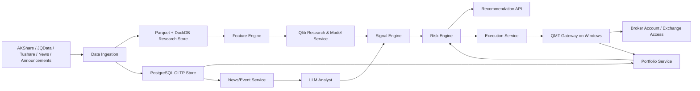

# A股智能量化交易平台设计文档

- 文档版本: v1.0
- 日期: 2026-04-25
- 状态: Draft
- 适用范围: 新建项目，个人或小团队使用，面向中国 A 股市场

## 1. Context

### 1.1 Current System Summary

当前仓库为空目录，本项目为全新设计，不存在历史系统包袱。设计目标不是复刻单一开源仓库，而是基于成熟开源组件拼装一套可研究、可推荐、可接实盘、可持续演进的 A 股智能量化交易平台。

### 1.2 Problem Statement

用户希望系统具备以下能力：

1. 获取中国股市尽可能完整的历史数据。
2. 在交易日实时获取行情、账户、持仓与订单状态。
3. 结合市场波动、新闻、公告、基本面、技术面给出买入和卖出建议。
4. 记录并展示“买了什么、买了多少股、成本、盈亏、仓位”等资产状态。
5. 尽量智能，但不能失去可解释性、风控约束与实盘可控性。

### 1.3 Constraints

1. 市场范围限定为中国 A 股，后续可扩展 ETF、可转债、指数、期货，但不作为第一期必需范围。
2. 历史数据至少覆盖全市场日线全历史，分钟级全市场全历史不作为免费 MVP 的硬性前提，因为这通常依赖商业数据授权、存储成本和更复杂的数据治理。
3. 实盘执行优先考虑 `QMT/miniQMT` 生态，因为这是 A 股个人量化相对稳妥的落地路径。
4. `xtquant/QMT` 生态通常依赖 Windows 环境，因此主服务与交易网关可能需要跨系统部署。
5. 系统默认先做“建议 + 人工确认下单”，自动下单属于后续可选能力。
6. LLM 只作为分析器和解释器，不允许绕过风险引擎直接决定实盘委托。
7. 数据源与券商接口存在可用性、限频、授权、版本兼容等现实约束。

### 1.4 Business and Compliance Boundaries

1. 本系统是投资研究与交易辅助平台，不承诺收益，不将任何单次信号视为确定性结论。
2. 所有建议必须附带理由、置信度和风险提示。
3. 实盘阶段必须保留审计日志，确保每次建议、风控裁决、下单动作都可追溯。

## 2. Goals and Non-Goals

### 2.1 Goals

1. 建成覆盖 A 股研究、推荐、持仓管理、风险控制和实盘接入的一体化平台。
2. 支持全市场股票基础资料、交易日历、复权日线历史、企业公告和新闻事件入库。
3. 在交易日支持实时行情采集与账户状态同步。
4. 生成结构化买卖建议，至少包含 `symbol`、`action`、`confidence`、`horizon`、`reason`、`risk_flags`。
5. 支持组合级视角，能根据已有持仓、现金、仓位、行业暴露和风险限制给出建议，而不是只看单票。
6. 支持研究回测、Walk-forward 验证、模拟盘和实盘分阶段落地。
7. 支持“可解释的智能决策”，把技术面、基本面、新闻情绪、市场状态和已有仓位统一纳入决策。

### 2.2 Measurable Success Criteria

1. 能在 1 个交易日内完成全市场日线增量更新。
2. 在交易时间内，实时行情延迟目标小于 3 秒，账户/持仓同步延迟目标小于 10 秒。
3. 推荐服务在新行情或新事件触发后 60 秒内完成一次增量重算。
4. 回测和模拟盘的信号生成逻辑与实盘前信号生成逻辑共享 80% 以上核心代码。
5. 所有建议都能回溯到输入数据版本、模型版本、风控规则版本和新闻解释版本。

### 2.3 Non-Goals

1. 第一阶段不追求做成高频交易系统。
2. 第一阶段不追求支持逐笔 Tick 全历史全市场永久存储。
3. 第一阶段不追求多券商、多市场、多资产类别同时实盘。
4. 第一阶段不做完全无人值守自动交易。
5. 第一阶段不构建复杂微服务集群和大规模分布式算力平台。

## 3. Option Analysis

### 3.1 Option A: 直接基于“大而全”开源项目二次开发

代表思路：

1. 直接 Fork 类似 `Qbot` 这类平台化项目。
2. 或直接围绕 `A_Share_investment_Agent` 扩写到实盘。

优点：

1. 上手快，能快速看到 UI、策略、任务流原型。
2. 初期 Demo 速度快。

缺点：

1. 代码风格和架构边界通常不够稳定。
2. 实盘、账户、风控、数据质量和 AI 逻辑往往耦合严重。
3. 很多项目更适合展示思路，不适合作为长期生产基座。

适用场景：

1. 快速做概念验证。
2. 不适合作为未来 1 到 2 年持续演进的主线架构。

### 3.2 Option B: 研究与交易解耦的模块化单体

代表思路：

1. 用 `AKShare/JQData/Tushare` 负责数据。
2. 用 `Qlib` 负责研究、特征、回测、模型训练。
3. 自建 `Portfolio/Risk/Recommendation/API`。
4. 用 `QMT/miniQMT` 网关负责账户同步与下单。

优点：

1. 架构边界清楚，适合从 0 到 1 演进。
2. 研究、推荐、风控、实盘之间职责明确，后续可替换单个组件。
3. 既能快速交付 MVP，又不至于把未来扩展空间锁死。
4. 对个人或小团队最现实。

缺点：

1. 需要自己补齐产品层和账户层。
2. 初期需要设计数据模型和任务编排，而不是纯粹依赖现成框架。

适用场景：

1. 需要长期维护的量化平台。
2. 需要 AI、研究、实盘协同但不想一开始上微服务。

### 3.3 Option C: 以 vn.py 为核心的生产优先架构

代表思路：

1. 以 `vn.py` 为主交易内核。
2. 数据、AI 推荐、新闻分析围绕其扩展。

优点：

1. 实盘能力强，生态成熟。
2. 更接近交易系统，而不是单纯研究系统。

缺点：

1. 对“智能推荐产品”来说，研究层、新闻层、Web 产品层往往仍需较大补充。
2. 如果一开始就围绕交易框架设计，容易把产品形态限定得太死。

适用场景：

1. 明确以实盘执行为首要目标。
2. 团队对交易框架和网关开发较熟。

### 3.4 Trade-off Table

| 方案 | 实现复杂度 | 风险 | 演进性 | 研究能力 | 实盘能力 | 适合当前需求 |
| --- | --- | --- | --- | --- | --- | --- |
| Option A 大而全项目二开 | 低 | 高 | 低 | 中 | 低到中 | 一般 |
| Option B 模块化单体 | 中 | 中 | 高 | 高 | 高 | 最优 |
| Option C vn.py 为核心 | 中 | 中 | 中 | 中 | 高 | 较优 |

### 3.5 Recommended Option

推荐采用 **Option B: 研究与交易解耦的模块化单体**。

推荐理由：

1. 当前仓库为空，更适合从边界清晰的架构开始。
2. 你要的不只是“能下单”，而是“会分析、会推荐、会管理持仓、会解释原因”。
3. 量化项目最容易失控的地方是数据、风控和交易链路，模块化单体可以降低复杂度而不牺牲长期可维护性。
4. 未来若需要拆服务，可以自然把 `market-data`、`research`、`execution-gateway` 独立出去。

## 4. Target Architecture

### 4.1 Recommended Open Source Foundation

本项目不直接依赖单一仓库，而是按职责复用以下开源组件：

1. `AKShare`: 免费主数据源，覆盖 A 股行情、公告、新闻、宏观、板块等，适合作为默认入口。
2. `JQData/Tushare Pro`: 作为稳定增强数据源，用于补齐质量、字段或分钟级能力。
3. `Qlib`: 负责因子研究、模型训练、回测、组合评价。
4. `vn.py` 或 `qka`: 负责交易框架与 QMT 生态对接。
5. `easytrader`: 可作为备选账户查询或轻量交易接入方案，但不作为主生产路径。
6. `A_Share_investment_Agent` 与 `FinRobot/FinGPT`: 主要借鉴多 Agent 分析和新闻理解思路，不直接作为实盘核心。

### 4.2 Architecture Overview



### 4.3 Module Boundaries

#### 4.3.1 `market-data`

职责：

1. 拉取证券基础资料、交易日历、日线、分钟线、板块、财务、资金流、公告、新闻。
2. 管理多数据源优先级和回退策略。
3. 输出标准化数据结构。

边界：

1. 不做模型预测。
2. 不做持仓决策。

#### 4.3.2 `research-lab`

职责：

1. 构建因子、标签、样本集。
2. 训练择时、选股、打分和组合模型。
3. 提供回测、Walk-forward、策略评估。

边界：

1. 不直接下单。
2. 不直接持有账户状态。

#### 4.3.3 `news-event-service`

职责：

1. 采集新闻、公告、研报、宏观事件。
2. 做去重、清洗、事件提取、情绪打分、主题归类。
3. 产出股票级、板块级、市场级事件特征。

#### 4.3.4 `llm-analyst`

职责：

1. 对新闻和公告做摘要、情绪判断、风险点提取。
2. 用结构化提示词生成“建议解释”，而不是生成裸建议。
3. 参与多 Agent 评审，如“技术面分析师”“基本面分析师”“新闻分析师”“风险官”。

边界：

1. 不能绕过风险引擎。
2. 不能直接创建实盘委托。

#### 4.3.5 `signal-engine`

职责：

1. 聚合技术面、基本面、事件面、市场状态、组合状态。
2. 输出候选信号和排序分数。
3. 支持多模型集成和规则融合。

#### 4.3.6 `risk-engine`

职责：

1. 控制单票仓位、单日换手、最大回撤、行业暴露、风格暴露、流动性、停牌、ST、涨跌停、公告禁买等。
2. 对建议进行过滤、降级或拒绝。
3. 产生风险事件与审计记录。

#### 4.3.7 `portfolio-service`

职责：

1. 维护账户、现金、持仓、订单、成交、成本、浮盈亏和已实现盈亏。
2. 同步 QMT 网关返回的账户快照。
3. 作为推荐层的持仓上下文来源。

#### 4.3.8 `execution-service`

职责：

1. 处理模拟盘和实盘下单请求。
2. 做下单前校验、风控确认、订单状态跟踪。
3. 与 QMT 网关通信。

#### 4.3.9 `web-console`

职责：

1. 展示行情、推荐、回测、持仓、订单、风控告警和解释。
2. 提供人工确认下单入口。

### 4.4 Deployment Topology

推荐部署形态：

1. Linux 或 macOS 主服务节点：
   - API 服务
   - 数据采集任务
   - 研究任务
   - 推荐服务
   - PostgreSQL
   - Redis
   - DuckDB/Parquet 数据仓
2. Windows 交易网关节点：
   - `QMT/miniQMT`
   - `xtquant` 适配器
   - 网关 API
   - 账户和委托事件转发器

设计原因：

1. 把研究和产品逻辑放在主节点，方便开发。
2. 把券商和终端依赖隔离在 Windows，降低主系统耦合。
3. Windows 节点可以替换、重启或限权，不影响研究链路。

### 4.5 Core Processing Flows

#### 4.5.1 历史数据回补流程

1. 拉取交易日历和证券主数据。
2. 按股票分区回补日线全历史。
3. 拉取复权因子、停复牌、退市、企业行为。
4. 对齐交易日历，校验缺失。
5. 入库到 Parquet 和 PostgreSQL。
6. 触发特征重建和模型训练。

#### 4.5.2 交易日实时流程

1. 开盘前刷新证券列表、当日风险黑名单、模型版本和账户状态。
2. 盘中实时拉取行情与新闻。
3. 增量更新特征与事件评分。
4. 生成候选信号。
5. 经过风险引擎过滤。
6. 生成推荐并更新 UI。
7. 如用户确认，则发送下单请求。
8. 回写订单、成交、持仓和资金变化。

#### 4.5.3 推荐生成流程

1. 市场状态模型先判断大盘 regime，如风险偏好、波动扩张、板块轮动。
2. 单票模型对目标池打分。
3. 新闻事件和 LLM 分析生成修正分或风险标签。
4. 组合上下文决定是否已有重复暴露、是否需要减仓而不是加仓。
5. 风险引擎输出最终可执行建议。

## 5. Data and Interfaces

### 5.1 Storage Strategy

#### 5.1.1 PostgreSQL

用于事务型数据和查询型元数据：

1. 用户与账户配置
2. 持仓、订单、成交、资金
3. 推荐结果
4. 风控事件
5. 任务运行记录
6. 新闻元数据和事件标签

#### 5.1.2 Parquet + DuckDB

用于研究分析型数据：

1. 全市场日线历史
2. 分钟线批量历史
3. 特征表
4. 训练样本
5. 回测结果快照

设计原因：

1. Parquet 成本低，适合大批量列式读取。
2. DuckDB 对单机分析非常实用，开发效率高。
3. PostgreSQL 不适合作为大规模 K 线特征计算主仓。

#### 5.1.3 Redis

用于：

1. 实时行情缓存
2. 任务队列
3. 短时事件流
4. 限频控制

### 5.2 Data Scope Definition

#### 5.2.1 MVP 必须覆盖

1. A 股股票基础资料和上市状态。
2. 全市场日线前复权和不复权历史。
3. 交易日实时快照。
4. 指数、行业板块、成交额、换手率等市场状态指标。
5. 新闻、公告和事件标签。
6. 账户、持仓、订单、成交、资金变动。

#### 5.2.2 MVP 可选覆盖

1. 全市场近 120 到 240 个交易日分钟线。
2. 核心股票池更长周期分钟线。
3. 高质量财务字段和研报摘要。

#### 5.2.3 非 MVP

1. 全市场逐笔 Tick 全历史。
2. 全市场分钟线永久无上限保留。

### 5.3 Canonical Schemas

以下为核心表设计概要。

#### 5.3.1 `instrument`

关键字段：

1. `symbol`
2. `exchange`
3. `name`
4. `industry`
5. `list_date`
6. `delist_date`
7. `status`
8. `is_st`

#### 5.3.2 `trading_calendar`

关键字段：

1. `trade_date`
2. `market`
3. `is_open`
4. `session_type`

#### 5.3.3 `market_bar_daily`

关键字段：

1. `symbol`
2. `trade_date`
3. `open`
4. `high`
5. `low`
6. `close`
7. `volume`
8. `amount`
9. `turnover_rate`
10. `adj_type`
11. `data_source`

唯一键：

1. `(symbol, trade_date, adj_type, data_source)`

#### 5.3.4 `market_bar_1m`

关键字段：

1. `symbol`
2. `bar_time`
3. `open`
4. `high`
5. `low`
6. `close`
7. `volume`
8. `amount`

#### 5.3.5 `realtime_quote`

关键字段：

1. `symbol`
2. `quote_time`
3. `last_price`
4. `bid1`
5. `ask1`
6. `volume`
7. `turnover`
8. `pct_change`
9. `limit_up`
10. `limit_down`

#### 5.3.6 `news_article`

关键字段：

1. `article_id`
2. `source`
3. `title`
4. `published_at`
5. `url`
6. `content_hash`
7. `raw_text`
8. `symbols`

#### 5.3.7 `news_event`

关键字段：

1. `event_id`
2. `article_id`
3. `event_type`
4. `sentiment_score`
5. `urgency_score`
6. `relevance_score`
7. `summary`
8. `llm_reasoning_version`

#### 5.3.8 `factor_snapshot`

关键字段：

1. `symbol`
2. `as_of_time`
3. `factor_name`
4. `factor_value`
5. `feature_set_version`

#### 5.3.9 `model_run`

关键字段：

1. `run_id`
2. `model_name`
3. `model_version`
4. `train_window`
5. `score_metrics`
6. `artifact_uri`

#### 5.3.10 `signal_snapshot`

关键字段：

1. `signal_id`
2. `symbol`
3. `as_of_time`
4. `signal_type`
5. `raw_score`
6. `expected_horizon`
7. `model_version`
8. `explanation_ref`

#### 5.3.11 `recommendation`

关键字段：

1. `recommendation_id`
2. `symbol`
3. `action`
4. `target_weight`
5. `confidence`
6. `time_horizon`
7. `reason_summary`
8. `risk_flags`
9. `status`
10. `created_at`

#### 5.3.12 `portfolio`

关键字段：

1. `portfolio_id`
2. `account_id`
3. `portfolio_name`
4. `base_currency`
5. `status`

#### 5.3.13 `position`

关键字段：

1. `position_id`
2. `account_id`
3. `symbol`
4. `quantity`
5. `available_quantity`
6. `avg_cost`
7. `market_value`
8. `unrealized_pnl`
9. `realized_pnl`
10. `updated_at`

#### 5.3.14 `order`

关键字段：

1. `order_id`
2. `account_id`
3. `symbol`
4. `side`
5. `order_type`
6. `price`
7. `quantity`
8. `status`
9. `broker_order_id`
10. `source`

#### 5.3.15 `trade_fill`

关键字段：

1. `fill_id`
2. `order_id`
3. `symbol`
4. `fill_price`
5. `fill_quantity`
6. `fill_time`
7. `commission`

#### 5.3.16 `risk_rule`

关键字段：

1. `rule_id`
2. `rule_type`
3. `scope`
4. `threshold`
5. `action_on_breach`
6. `enabled`

#### 5.3.17 `risk_event`

关键字段：

1. `event_id`
2. `rule_id`
3. `symbol`
4. `severity`
5. `message`
6. `decision`
7. `created_at`

### 5.4 Backfill and Migration Plan

#### 5.4.1 历史回补

1. 先建 `instrument` 和 `trading_calendar`。
2. 对全市场拉取日线全历史。
3. 对历史数据做缺口检查和复权校验。
4. 再逐步扩展分钟线。
5. 补齐新闻和公告的近一年回溯。

#### 5.4.2 增量更新

1. 每日收盘后刷新日线、财务和企业行为。
2. 盘中按秒级或数秒级刷新实时行情。
3. 新闻按轮询或流式方式增量采集。

#### 5.4.3 数据质量控制

1. 每日校验交易日数与数据源返回数量。
2. 校验 OHLC 合法性和涨跌停边界。
3. 对新闻做 `content_hash` 去重。
4. 对订单和成交做幂等写入。

### 5.5 API Contracts

API 建议采用 `FastAPI + REST` 为主，必要时加 WebSocket 推送行情和订单事件。

#### 5.5.1 Market APIs

`GET /api/v1/market/instruments`

功能：

1. 获取证券列表和基础信息。

`GET /api/v1/market/bars?symbol=600519.SH&freq=1d&start=2020-01-01&end=2026-04-25`

功能：

1. 获取历史 K 线。

`GET /api/v1/market/quotes/realtime?symbols=600519.SH,000001.SZ`

功能：

1. 获取实时快照。

#### 5.5.2 Recommendation APIs

`GET /api/v1/recommendations/latest`

返回示例：

```json
{
  "asOf": "2026-04-25T10:35:00+08:00",
  "items": [
    {
      "symbol": "600519.SH",
      "action": "BUY",
      "targetWeight": 0.08,
      "confidence": 0.74,
      "horizon": "swing_5d",
      "reasonSummary": "量价趋势保持，多因子得分上升，负面新闻缺失，组合当前白酒暴露仍在阈值内。",
      "riskFlags": ["HIGH_PRICE_VOLATILITY"]
    }
  ]
}
```

`POST /api/v1/recommendations/explain`

功能：

1. 生成更长的解释文本和来源引用。

#### 5.5.3 Portfolio APIs

`GET /api/v1/portfolio/summary`

功能：

1. 获取总资产、现金、持仓市值、当日盈亏、累计盈亏。

`GET /api/v1/portfolio/positions`

功能：

1. 获取所有持仓及成本信息。

#### 5.5.4 Execution APIs

`POST /api/v1/orders/simulate`

功能：

1. 在模拟盘验证订单是否通过风控。

`POST /api/v1/orders/live`

功能：

1. 发起实盘委托。
2. 默认要求人工确认 token。

#### 5.5.5 Error Model

统一错误格式：

```json
{
  "error": {
    "code": "RISK_RULE_BLOCKED",
    "message": "Target weight exceeds single-stock limit",
    "requestId": "req_123",
    "details": {
      "symbol": "600519.SH",
      "rule": "single_stock_max_weight"
    }
  }
}
```

常见错误码：

1. `DATA_SOURCE_UNAVAILABLE`
2. `INVALID_SYMBOL`
3. `MODEL_NOT_READY`
4. `RISK_RULE_BLOCKED`
5. `BROKER_GATEWAY_UNAVAILABLE`
6. `ORDER_DUPLICATED`
7. `MANUAL_CONFIRMATION_REQUIRED`

## 6. Strategy and Intelligence Design

### 6.1 Decision Layers

推荐采用四层决策：

1. 市场层：判断当前是风险偏好扩张、震荡还是风险收缩。
2. 选股层：对股票池做收益概率和风险收益比排序。
3. 事件层：根据新闻、公告、研报、资金流对排序进行修正。
4. 组合层：根据已有持仓、相关性和风险暴露做最终裁决。

### 6.2 Signal Composition

最终分数建议由以下部分组成：

`final_score = alpha_score + event_score + regime_adjustment - risk_penalty - exposure_penalty`

说明：

1. `alpha_score` 来自 Qlib 因子或机器学习模型。
2. `event_score` 来自新闻情绪、公告解析和主题事件。
3. `regime_adjustment` 来自大盘状态模型。
4. `risk_penalty` 来自波动率、流动性、极端回撤、停牌与监管风险。
5. `exposure_penalty` 来自组合重仓和行业集中度。

### 6.3 LLM Usage Principles

LLM 只做以下事情：

1. 新闻摘要和归类。
2. 公告事件抽取，如并购、业绩预告、回购、减持、监管处罚。
3. 对推荐结果生成解释文本。
4. 多 Agent 观点整合。

LLM 不做以下事情：

1. 不直接决定订单。
2. 不绕过风控。
3. 不在缺少结构化行情输入时裸推股票。

### 6.4 Multi-Agent Pattern

推荐内部使用以下角色：

1. `Market Analyst`: 分析指数、风格、板块轮动和风险偏好。
2. `Technical Analyst`: 分析趋势、动量、量价结构和波动。
3. `Fundamental Analyst`: 分析财务质量和估值。
4. `News Analyst`: 解析新闻、公告和舆情。
5. `Portfolio Manager`: 结合已有持仓给出调仓建议。
6. `Risk Officer`: 对候选建议给出允许、降级或拒绝。

最终由规则化裁决器收敛为结构化建议。

## 7. Operational Design

### 7.1 Logging, Metrics, Tracing

#### 7.1.1 Logging

日志必须结构化，至少包含：

1. `timestamp`
2. `service`
3. `request_id`
4. `symbol`
5. `account_id`
6. `model_version`
7. `data_source`
8. `decision_type`

#### 7.1.2 Metrics

关键指标：

1. 数据拉取成功率
2. 实时行情延迟
3. 模型推理耗时
4. 推荐生成频率
5. 风控阻断次数
6. 订单成功率
7. 持仓同步延迟

#### 7.1.3 Tracing

一条推荐链路应能追踪：

1. 哪批行情触发
2. 哪版特征和模型参与
3. 哪些新闻事件参与
4. 哪条风险规则生效
5. 是否生成订单

### 7.2 SLO and Reliability Targets

1. 历史数据日更任务成功率不低于 99%。
2. 盘中实时快照延迟目标小于 3 秒。
3. 推荐链路 P95 耗时小于 30 秒。
4. 账户同步 P95 延迟小于 10 秒。
5. 订单状态更新最终一致性目标小于 30 秒。

### 7.3 Capacity Expectations

1. A 股股票数量约数千只，全市场日线历史在单机 Parquet 下可承载。
2. 分钟线数据体量显著更大，应按年份和代码分区。
3. 新闻正文和模型输出建议单独存储并做压缩。
4. 第一阶段单机部署即可满足个人或小团队使用。

### 7.4 Failure Strategy

1. 主数据源不可用时，自动回退备用数据源。
2. 实时行情失败时，推荐服务降级为最近可用快照，不触发自动下单。
3. QMT 网关不可用时，禁止实盘下单，但允许查看研究和推荐。
4. LLM 服务不可用时，保留结构化信号和风控建议，只缺失解释文本。
5. 风控服务失败时，执行默认拒绝策略。

## 8. Security Design

### 8.1 Authentication and Authorization

第一阶段建议：

1. 单用户或小团队 RBAC。
2. 角色至少分为 `admin`、`trader`、`viewer`。
3. 实盘下单权限单独控制。

### 8.2 Sensitive Data Handling

1. 券商账号、终端路径、接口令牌、LLM API Key 全部通过密钥管理读取。
2. Windows 交易网关单独保存券商配置，不回传明文凭据到主服务。
3. 持仓和交易记录可视为敏感数据，需要鉴权访问。

### 8.3 Secret and Config Management

1. 开发环境使用 `.env`。
2. 生产环境使用系统密钥管理或专用密钥服务。
3. 模型版本、特征版本、风控规则版本都必须显式配置。

### 8.4 Auditability

以下动作必须写审计日志：

1. 风控规则变更
2. 模型版本切换
3. 实盘下单和撤单
4. 手工修改持仓或账户状态
5. LLM 提示词和解释模板更新

## 9. Rollout Plan

### 9.1 Phase 0: Project Scaffold

目标：

1. 建立仓库结构、基础依赖、CI、配置体系和数据库迁移框架。

交付物：

1. `apps/api`
2. `apps/web`
3. `services/qmt-gateway`
4. `libs/*`
5. `infra/*`

验收标准：

1. 本地能启动空白 API 和 Web 控制台。
2. PostgreSQL 迁移链路可执行。

### 9.2 Phase 1: Data Foundation

目标：

1. 打通证券主数据、交易日历、日线全历史和实时快照。

交付物：

1. 数据采集任务
2. 历史数据入库
3. 数据质量校验

验收标准：

1. 任意股票可查询全历史日线。
2. 交易日内可获取实时快照。

回滚策略：

1. 停用实时任务，保留历史查询。

### 9.3 Phase 2: Research and Backtest

目标：

1. 建立特征工程、模型训练、回测流程。

交付物：

1. 因子库
2. 回测框架
3. 模型版本管理

验收标准：

1. 可对股票池输出候选打分。
2. 回测报告可复现。

### 9.4 Phase 3: Portfolio and Risk

目标：

1. 建立账户、持仓、订单、成交和风控体系。

交付物：

1. 组合服务
2. 风控规则引擎
3. 推荐裁决器

验收标准：

1. 推荐结果能感知当前持仓和现金。
2. 违规建议会被阻断并记录原因。

### 9.5 Phase 4: Simulation and QMT Integration

目标：

1. 打通模拟盘和实盘网关。

交付物：

1. QMT 网关
2. 订单同步
3. 成交回写

验收标准：

1. 从 UI 提交订单后能看到委托状态变化。
2. 成交后持仓和资金更新正确。

回滚策略：

1. 切回模拟盘。
2. 关闭实盘下单接口。

### 9.6 Phase 5: AI Recommendation Upgrade

目标：

1. 引入新闻和公告事件分析、多 Agent 解释和组合级智能建议。

交付物：

1. 事件解析器
2. LLM 解释服务
3. 推荐解释视图

验收标准：

1. 推荐不仅给出动作，还给出基于行情、事件和仓位的解释。
2. 推荐延迟满足交易日盘中要求。

### 9.7 Phase 6: Production Hardening

目标：

1. 建立告警、审计、恢复、备份和观测体系。

交付物：

1. 监控告警面板
2. 数据备份脚本
3. 容灾和恢复手册

验收标准：

1. 核心任务异常时会触发告警。
2. 历史数据和交易记录可恢复。

## 10. Test Plan

### 10.1 Unit Tests

覆盖范围：

1. 指标和因子计算
2. 风控规则评估
3. 订单状态机
4. 新闻去重和事件提取
5. 推荐融合逻辑

### 10.2 Integration Tests

覆盖范围：

1. 数据源拉取到入库
2. 推荐链路从行情到结果
3. QMT 网关模拟交互
4. 下单到成交回写

### 10.3 Regression Tests

覆盖范围：

1. 历史回测结果漂移检查
2. 模型升级后的信号差异检查
3. 风控规则变更影响检查

### 10.4 Smoke Tests

交易日开盘前最少执行：

1. 主数据源联通性检查
2. QMT 网关联通性检查
3. 账户同步检查
4. 推荐服务检查
5. 实盘权限检查

### 10.5 Replay Tests

必须支持历史日回放：

1. 用历史行情和新闻重放某个交易日。
2. 验证当时建议是否与真实逻辑一致。

## 11. Acceptance Criteria

### 11.1 Functional Acceptance

1. 能查询任意股票全历史日线。
2. 能在交易日看到实时行情。
3. 能查看账户、持仓、订单、成交和盈亏。
4. 能生成带理由和置信度的买卖建议。
5. 能对建议执行风控阻断。
6. 能接入 QMT 完成模拟或实盘委托。

### 11.2 Performance and Reliability Acceptance

1. 推荐服务在盘中负载下稳定运行。
2. 历史任务失败可重试且不产生重复脏数据。
3. QMT 短时中断不会破坏主系统数据完整性。

### 11.3 Operational Readiness Checklist

1. 有日志、指标、告警。
2. 有数据库备份。
3. 有模型版本管理。
4. 有风控规则配置和审计。
5. 有手动接管和紧急停单机制。

## 12. Key Risks and Mitigations

### 12.1 数据源不稳定

风险：

1. 免费接口失效、限频或字段变更。

缓解：

1. 设计多源优先级。
2. 建立数据质量校验和缓存。
3. 重要链路预留 `JQData/Tushare Pro` 升级路径。

### 12.2 LLM 幻觉和错误归因

风险：

1. 解释看起来合理，但事实错误。

缓解：

1. 只允许 LLM 使用结构化输入和已采集新闻。
2. 输出必须附来源。
3. 决策仍以结构化模型和风控为准。

### 12.3 实盘网关不稳定

风险：

1. Windows 终端异常或接口波动导致下单失败。

缓解：

1. 网关独立部署。
2. 下单和状态同步采用幂等协议。
3. 默认人工确认下单。

### 12.4 全市场分钟历史成本高

风险：

1. 存储、带宽和数据授权成本迅速上升。

缓解：

1. 第一阶段只做全历史日线 + 近周期分钟线。
2. 对重点股票池保留更长分钟历史。

## 13. Suggested Repository Layout

```text
docs/
  quant-trading-platform-design.md
apps/
  api/
  web/
services/
  qmt-gateway/
libs/
  market_data/
  research/
  features/
  portfolio/
  risk/
  recommendations/
  execution/
  llm_analyst/
pipelines/
  backfill/
  intraday/
  news/
infra/
  docker/
  migrations/
  scripts/
tests/
  unit/
  integration/
  replay/
```

## 14. Decisions Reserved for Next Step

以下问题会影响第一版实现，但不影响本设计文档成立：

1. 交易框架最终选 `vn.py` 还是 `qka`。
2. 是否从第一天就接入付费数据源。
3. 前端是先做简洁管理台，还是直接做更完整的交易工作台。
4. LLM 供应商选择和成本预算。

## 15. Final Recommendation

推荐按以下路线启动项目：

1. `AKShare` 作为默认数据主入口。
2. `Qlib` 作为研究和建模核心。
3. `PostgreSQL + Parquet + DuckDB` 作为数据底座。
4. `QMT/miniQMT` 作为实盘网关。
5. 自建 `Portfolio + Risk + Recommendation + Explanation` 产品层。
6. 默认人工确认下单，待模拟盘稳定后再开放自动执行。

这条路线兼顾可落地性、智能化空间和后续可维护性，明显优于直接依赖单一开源项目。

## 16. Reference Projects

以下项目用于选型参考：

1. [akfamily/akshare](https://github.com/akfamily/akshare)
2. [microsoft/qlib](https://github.com/microsoft/qlib)
3. [vnpy/vnpy](https://github.com/vnpy/vnpy)
4. [zsrl/qka](https://github.com/zsrl/qka)
5. [shidenggui/easytrader](https://github.com/shidenggui/easytrader)
6. [24mlight/A_Share_investment_Agent](https://github.com/24mlight/A_Share_investment_Agent)
7. [AI4Finance-Foundation/FinRobot](https://github.com/AI4Finance-Foundation/FinRobot)
